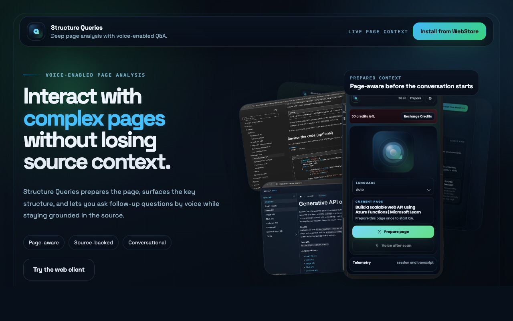
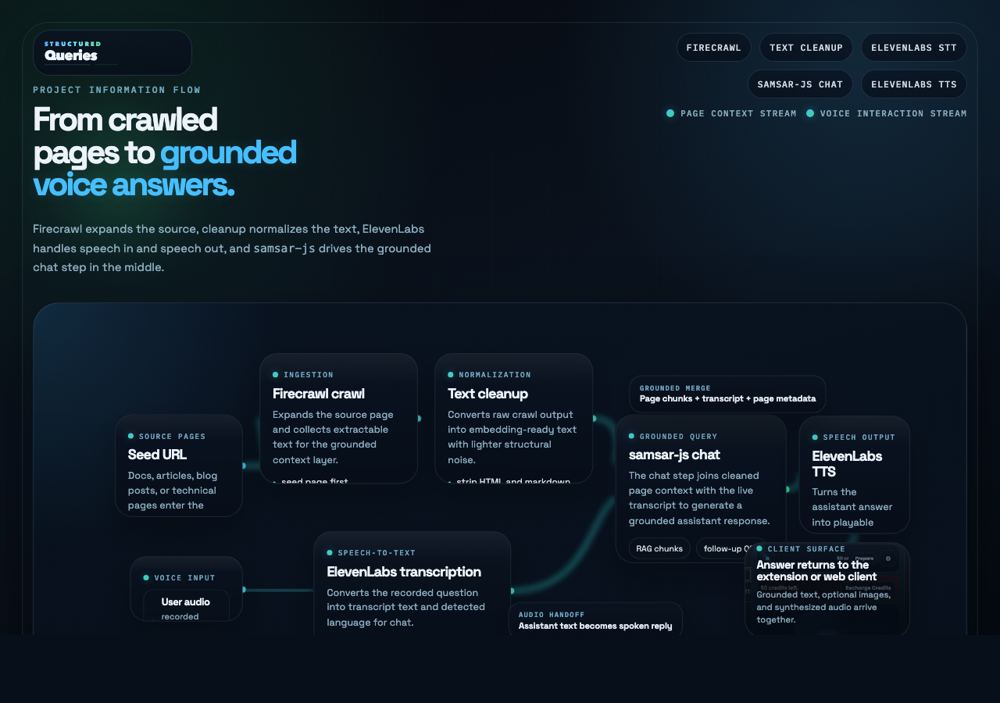
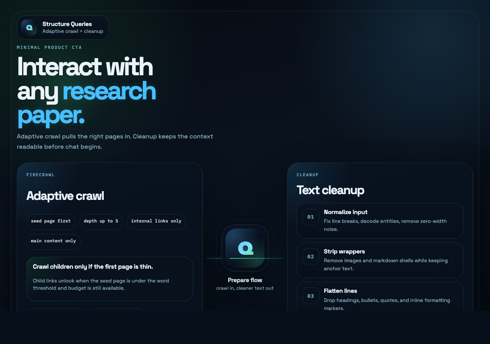
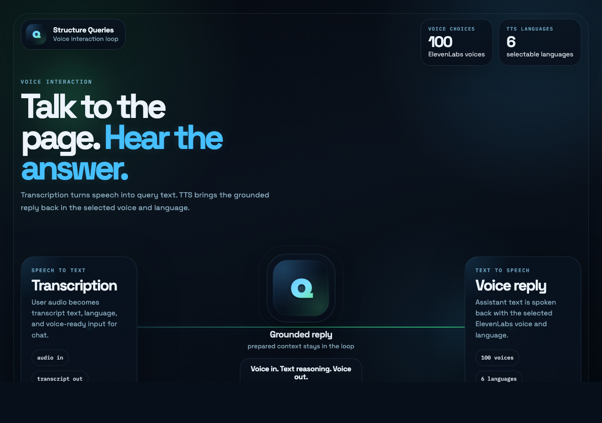
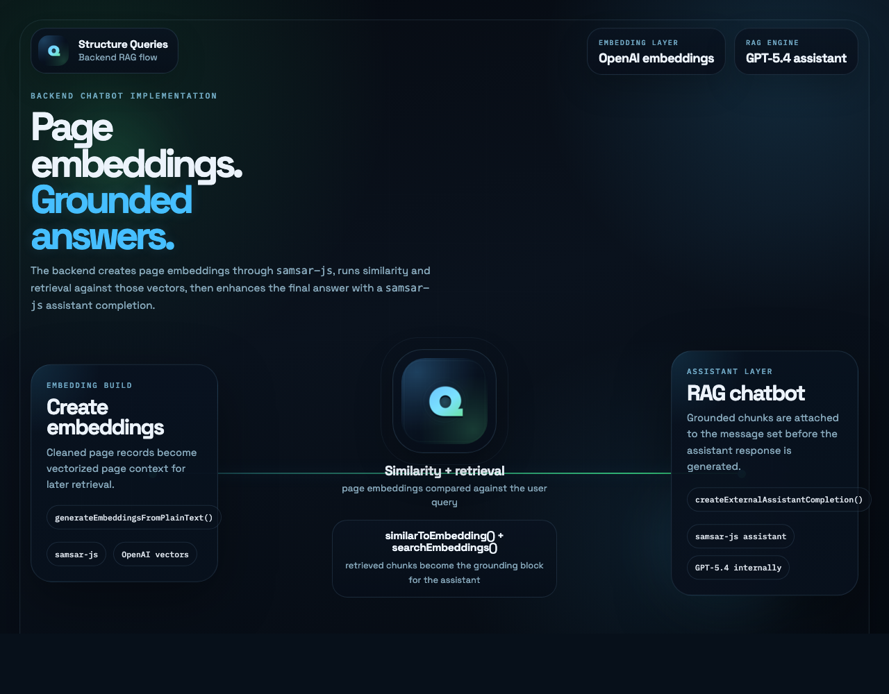

# Structure Queries

<p align="center">
  
</p>

Structure Queries is a voice-enabled page analysis app for dense web content such as research papers, articles, blog posts, and technical documentation.

The current implementation combines:

- Firecrawl for adaptive page crawling and extraction
- a cleanup pipeline for embedding-ready text
- `samsar-js` for page embeddings, similarity search, retrieval, and assistant completions
- ElevenLabs for transcription, voice selection, preview, and TTS playback

The repo is a monorepo with:

- `client/`: Chrome extension (Manifest V3) built with TypeScript + esbuild
- `client/public/`: public web client assets served by the backend at `/web-client`
- `server/`: Node.js API built with TypeScript + Express

## Product visuals

### Main splash



## Workflow visuals

### Information flow

This view captures the end-to-end product flow from page preparation to voice reply.



### Firecrawl + cleanup

This is the latest minimal crawl-and-cleanup visual.



### ElevenLabs transcription + TTS

This is the latest minimal voice-loop visual.



### Backend RAG chatbot

This view captures the current backend embedding, retrieval, and assistant-completion flow.



## Latest implementation

### Prepare-page pipeline

- `POST /api/webpages/analyze` runs the full prepare flow.
- Firecrawl is used through `server/src/lib/url-embedding-crawl.ts`.
- The crawl is seed-page-first: the source page is scraped before deeper crawling is attempted.
- Crawl depth is capped at `5` levels by `FIRECRAWL_CRAWL_LEVELS`.
- Crawl breadth is capped by `FIRECRAWL_MAX_LINKS` and the prepare-page credit budget.
- Child-link crawling only happens when the seed page is too short to stand on its own.
- The current adaptive threshold is `1200` words for the primary page.
- The current adaptive child-link cap is `5` prioritized links.
- Firecrawl requests are constrained to main content, with external links and subdomains disabled, and query parameters ignored.

### Text cleanup

- `cleanEmbeddingSourceText()` in `server/src/lib/embedding-text-cleanup.ts` prepares crawl output for embeddings.
- It normalizes line endings, removes zero-width characters, and decodes common HTML entities.
- Markdown image blocks are removed.
- Markdown links are reduced to anchor text.
- Heading markers, list markers, quote markers, and inline markdown wrappers are stripped at the line level.
- Boilerplate lines such as `skip to content`, `table of contents`, `menu`, `navigation`, and `search` are filtered out.
- Consecutive duplicate lines are removed.
- Large blank gaps are collapsed into cleaner paragraph spacing.

### Embeddings and retrieval

- Cleaned page records are sent to `samsarAdapter.generateEmbeddingsFromPlainText(...)`.
- The current backend iteration uses OpenAI embeddings for embedding creation and similarity comparison.
- Similarity lookup runs through `samsarAdapter.similarToEmbedding(...)`.
- Retrieval lookup runs through `samsarAdapter.searchEmbeddings(...)`.
- Retrieved chunks are converted into a grounding block before the assistant call.
- Current defaults are `8` similarity candidates and `6` retrieved chunks.

### Assistant completion

- The grounded chatbot implementation lives in `server/src/lib/chat-agent.ts`.
- After similarity and retrieval, grounded messages are sent to `samsarAdapter.createExternalAssistantCompletion(...)`.
- The current backend iteration uses GPT-5.4 internally for the RAG query engine.
- The response path supports grounded text replies and optional image generation metadata through the same assistant surface.

### Voice interaction

- The realtime voice gateway is exposed at `/ws/plugin`.
- User audio is transcribed with ElevenLabs before the grounded assistant request is made.
- Assistant replies can be synthesized back into audio with ElevenLabs TTS.
- `GET /api/voices` is used to populate remote ElevenLabs voice choices.
- The current voice list request fetches up to `100` ElevenLabs voices.
- The UI currently exposes `6` selectable non-auto TTS languages: `en`, `es`, `fr`, `de`, `hi`, `pt`
- `GET /api/voices/preview` is used for voice-preview playback.

### Clients and transport

- The Chrome extension and public web client both use the same analysis and chat backend.
- The public web client is served at `GET /web-client`.
- The backend also exposes an OpenAI-compatible surface at `POST /v1/chat/completions`.
- The proxy remains stateless: browser installs keep their `externalUserApiKey`, `assistantSessionId`, and `templateId` client-side, while assistant state lives upstream.

## Quick start

```bash
npm install
npm run dev:server
```

In a second terminal:

```bash
STRUCTUREDQUERIES_SERVER_ORIGIN=http://localhost:3000 npm run dev:client
```

Then:

- open the public web client at `http://localhost:3000/web-client`
- load the unpacked extension from `client/dist` in Chrome

The extension build defaults to `https://structurequeries.samsar.one`.
Set `STRUCTUREDQUERIES_SERVER_ORIGIN` before building or watching the client if you want a different backend origin, for example:

```bash
STRUCTUREDQUERIES_SERVER_ORIGIN=http://localhost:3000 npm run dev:client
```

For a production build:

```bash
STRUCTUREDQUERIES_SERVER_ORIGIN=https://structurequeries.samsar.one npm run build:client
```

## Structure

```text
client/
  public/        Static extension assets such as manifest and popup HTML
  scripts/       Build/watch tooling for the extension
  src/           Popup, background service worker, and content script
server/
  src/           Express app, routes, connectors, adapters, and RAG flow logic
assets/
  *.png          Latest splash and workflow visuals
```

## Workspace dependencies

### Root workspace

- npm workspaces for `client` and `server`
- scripts:
  - `npm run dev:server`
  - `npm run dev:client`
  - `npm run build`
  - `npm run check`

### Client workspace

The client workspace currently uses:

- `@types/chrome` `^0.1.38`
- `chokidar` `^4.0.3`
- `esbuild` `^0.27.4`
- `typescript` `^5.9.3`

Runtime notes:

- the extension is bundled for `chrome120`
- the public web client is plain static HTML/CSS/JS under `client/public`
- the public web client is served by the backend and does not have a separate package manifest

### Server workspace

The server workspace currently uses:

- `@elevenlabs/elevenlabs-js` `^2.39.0`
- `@mendable/firecrawl-js` `^4.16.0`
- `cors` `^2.8.6`
- `dotenv` `^17.3.1`
- `express` `^5.2.1`
- `mongodb` `^6.21.0`
- `mongoose` `^8.23.0`
- `samsar-js` `^0.48.12`
- `ws` `^8.19.0`

Server development dependencies:

- `@types/cors` `^2.8.19`
- `@types/express` `^5.0.6`
- `@types/node` `^25.5.0`
- `@types/ws` `^8.18.1`
- `tsx` `^4.21.0`
- `typescript` `^5.9.3`

## Local development

Copy `server/.env.example` to `server/.env` and fill in the integrations you want to use.

Create a Samsar account at [app.samsar.one](https://app.samsar.one) and generate a `SAMSAR_API_KEY` before running the server locally.

Minimum local server env:

```bash
PORT=3000
SAMSAR_API_KEY=your_samsar_api_key
FIRECRAWL_API_KEY=your_firecrawl_api_key
```

Optional server env already supported by the current code:

```bash
NODE_ENV=development
DOTENV_CONFIG_PATH=

ELEVENLABS_API_KEY=
ELEVENLABS_DEFAULT_VOICE_ID=
ELEVENLABS_DEFAULT_MODEL_ID=eleven_multilingual_v2

SAMSAR_PUBLIC_API_BASE_URL=https://api.samsar.one
APP_NAME=test
CURRENT_ENV=development

FIRECRAWL_API_URL=https://api.firecrawl.dev
FIRECRAWL_CRAWL_LEVELS=5
FIRECRAWL_MAX_LINKS=10
FIRECRAWL_POLL_INTERVAL_SECONDS=5
FIRECRAWL_TIMEOUT_SECONDS=120
```

Firecrawl local/self-hosted note:

- the server uses `@mendable/firecrawl-js`
- by default it targets `https://api.firecrawl.dev`
- by default the proxy allows up to `10` pages across up to `5` discovery levels
- the seed page is preferred first and child-link credits are only spent when the seed page is too short
- if you run Firecrawl locally, set `FIRECRAWL_API_URL` to your local Firecrawl base URL and set `FIRECRAWL_API_KEY` to the key expected by that instance
- webpage analysis endpoints require both `FIRECRAWL_API_KEY` and `SAMSAR_API_KEY`

## Clients and local URLs

### Chrome extension client

- build output: `client/dist`
- default local backend origin: `http://localhost:3000` when you set `STRUCTUREDQUERIES_SERVER_ORIGIN=http://localhost:3000`
- main flows use `POST /api/browser-sessions`, `POST /api/browser-sessions/register`, `POST /api/chat-completion`, `GET /api/webpages/status`, `POST /api/webpages/analyze`, and `GET /api/voices`

### Public web client

- served by the backend at `GET /web-client`
- static assets come from `client/public`
- websocket gateway: `/ws/plugin`
- the public client uses the same analysis, voice, and session APIs as the extension

## Backend stack

The current server runtime uses:

- ElevenLabs via `@elevenlabs/elevenlabs-js`
- Firecrawl via `@mendable/firecrawl-js`
- Samsar via `samsar-js`

Key backend entry points:

- `server/src/connectors/`: raw client and connection factories
- `server/src/adapters/`: higher-level wrappers on top of those connectors
- `server/src/lib/url-embedding-crawl.ts`: Firecrawl crawl, scrape, cleanup, and record-building flow
- `server/src/lib/embedding-text-cleanup.ts`: markdown and HTML cleanup for embedding-ready text
- `server/src/lib/chat-agent.ts`: similarity lookup, retrieval, grounding block assembly, and assistant completion
- `server/src/stack.ts`: backend registry and manifest
- `GET /api/stack`: runtime-visible stack manifest and configuration status
- `GET /api/voices`: ElevenLabs voice list surface
- `GET /api/voices/preview`: ElevenLabs preview proxy
- `POST /api/browser-sessions`: stateless browser-session sync
- `POST /api/browser-sessions/register`: explicit external-user registration for the extension install flow
- `POST /api/chat-completion`: proxy chat endpoint with grounded retrieval metadata
- `GET /api/webpages/status`: webpage embedding status lookup
- `POST /api/webpages/analyze`: Firecrawl-backed webpage analysis and embedding ingestion
- `POST /v1/chat/completions`: OpenAI-compatible text completion surface over the same grounded backend flow
- `/ws/plugin`: realtime transcription, assistant, and TTS loop

Copy the values you need from `server/.env.example` into your local server env before using the provider adapters.
